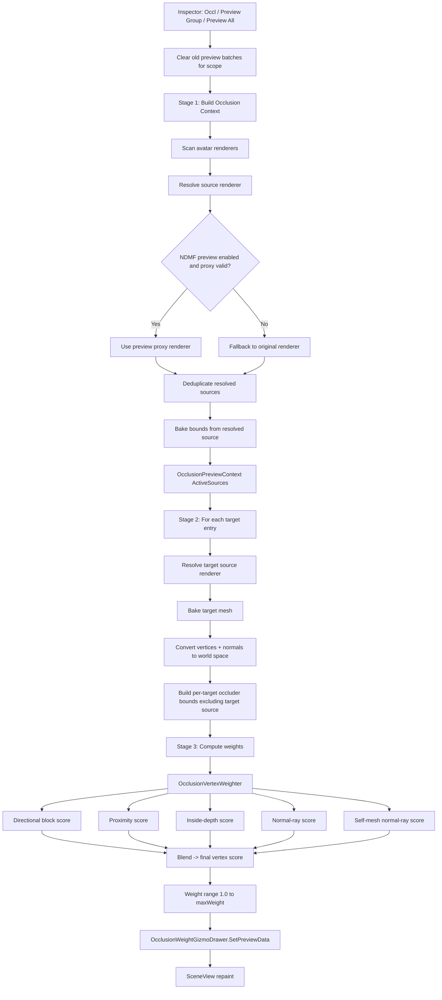

# Meshia Occlusion Preview Architecture

## Goal
When Occl is pressed in editor, preview must use the exact currently visible state:
- blendshape values
- skinned pose
- modular avatar / NDMF preview substitutions
- active/inactive renderer visibility

## Workflow Diagram

## Core Components
- MeshiaCascadingAvatarMeshSimplifierEditor
   - Orchestrates the 3-stage occlusion pipeline.
   - Owns source resolution between original and NDMF preview proxy renderers.
   - Rebuilds preview data per mesh/group/all scopes.
- MeshiaMeshSimplifierPreviewBase
   - Tracks original renderer to preview renderer mapping for NDMF preview mode.
- OcclusionVertexWeighter
   - Computes per-vertex occlusion score from multiple geometric signals.
- OcclusionWeightGizmoDrawer
   - Stores and renders sampled world-space preview points.

## Explicit Stage Contract

### Stage 1: Context Build
Input:
- Avatar root renderers
- NDMF preview state/cache

Output:
- OcclusionPreviewContext.ActiveSources[] where each item stores:
   - original renderer
   - resolved source renderer
   - source kind (original or NDMF proxy)
   - current world-space bounds

Rules:
- Use NDMF proxy only if preview is enabled and proxy renderer is valid+active.
- Always fallback to original renderer when proxy is unavailable/stale/inactive.
- Deduplicate by resolved source renderer.

### Stage 2: Target Bake + Occluder Collection
Input:
- One target entry
- Context ActiveSources

Output:
- Baked target mesh in world space
- Occluder bounds array specific to that target

Rules:
- Resolve target source with same policy as context.
- Exclude target source renderer from its own occluder set.
- Build occluder bounds array per target to avoid stale/shared buffer bugs.

### Stage 3: Weight Computation
Input:
- World-space mesh vertices/normals
- Per-target occluder bounds
- User weight strength

Output:
- Per-vertex simplification weights

Current scoring signals:
- Directional blocking (AABB slab + footprint)
- Proximity falloff to nearest occluder
- Inside-depth score for embedded points
- Normal-direction short ray intersection score
- Self-mesh normal-ray score (same-renderer body/clothing overlap in editor)

## Why This Refactor Exists
- Removes hidden state coupling between NDMF preview and occlusion preview.
- Makes each stage testable and debuggable in isolation.
- Prevents shared-buffer/indexing errors across renderers and scopes.
- Ensures blendshape and modular-avatar preview state are resolved explicitly.

## Debug Checklist
- Confirm context contains expected source kind per renderer (proxy vs original).
- Confirm target source is present and active at preview time.
- Confirm occluder count for target is greater than zero when coverage is expected.
- Confirm baked mesh normals are world-space before weight computation.
- Confirm stale preview data is cleared before rebuild.
